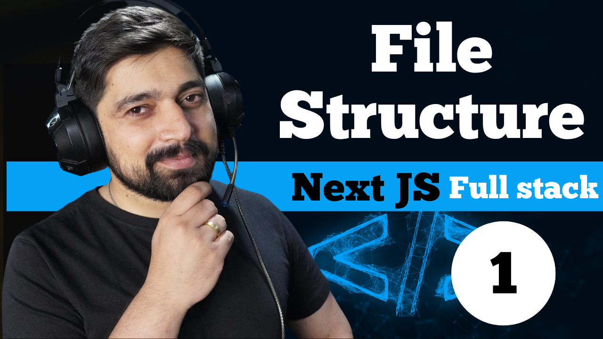

# 🔐 NextJS Authentication System

A production-ready full-stack authentication system built with **Next.js**, **MongoDB Atlas**, **JWT**, and **Gmail SMTP**.

## 🌐 Live Demo

👉 https://25-full-stack-authentication-system.vercel.app

## 📂 GitHub Repository

👉 https://github.com/Vinayak-123-jpj/25-full-stack-authentication-systems

---

## ✨ Features

- User Registration
- Secure Login & Logout
- JWT Authentication
- Email Verification
- Forgot Password
- Reset Password
- Protected Dashboard
- User Profile
- MongoDB Atlas Database
- Responsive UI

---

## 🛠️ Tech Stack

- Next.js
- React
- TypeScript
- Tailwind CSS
- Node.js
- MongoDB Atlas
- JWT
- Gmail SMTP
- Vercel

---

## 📸 Screenshots

### Login


### Dashboard


---

## 🚀 Run Locally

Clone the project

```bash
git clone https://github.com/Vinayak-123-jpj/25-full-stack-authentication-systems.git
```

Go to the project folder

```bash
cd 25-full-stack-authentication-systems
```

Install dependencies

```bash
npm install
```

Create a `.env` file and add your environment variables.

Run the project

```bash
npm run dev
```

Open

```
http://localhost:3000
```

---

## 🔑 Environment Variables

Create a `.env` file and add:

```env
MONGO_URI=
TOKEN_SECRET=
DOMAIN=
MAIL_HOST=
MAIL_PORT=
MAIL_USER=
MAIL_PASS=
```

---

## 📌 Authentication Flow

- Sign Up
- Verify Email
- Login
- Access Protected Dashboard
- Forgot Password
- Reset Password
- Logout

---

## 👨‍💻 Author

**Vinayak Dhyani**

GitHub: https://github.com/Vinayak-123-jpj

LinkedIn: https://www.linkedin.com/in/vinayak-dhyani-18b547373/

---

⭐ If you found this project useful, consider giving it a star.
